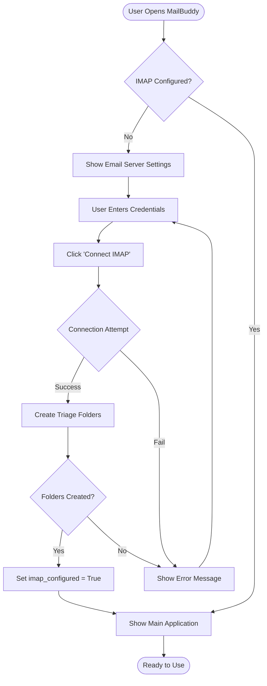
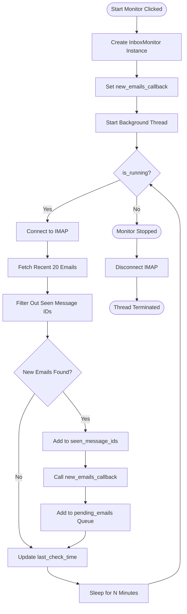
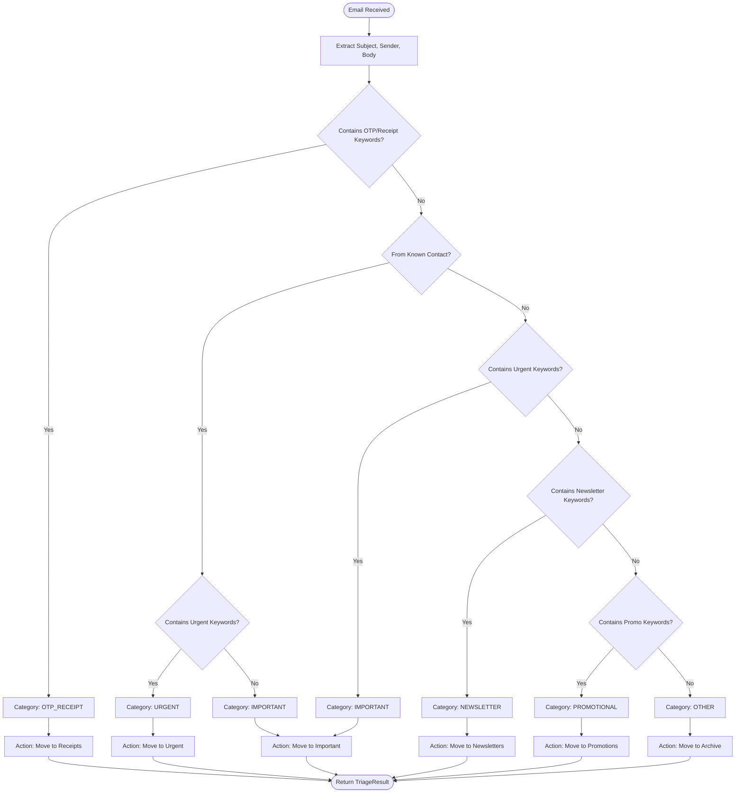
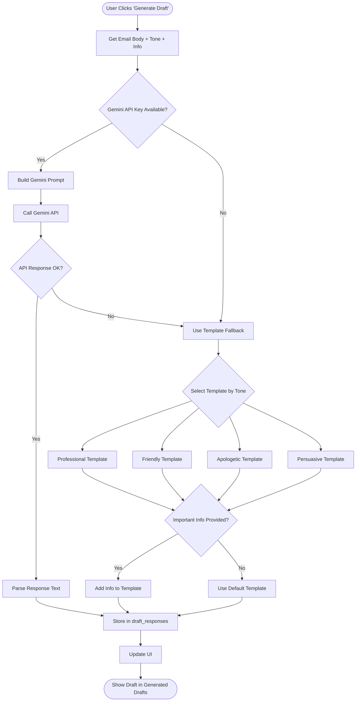
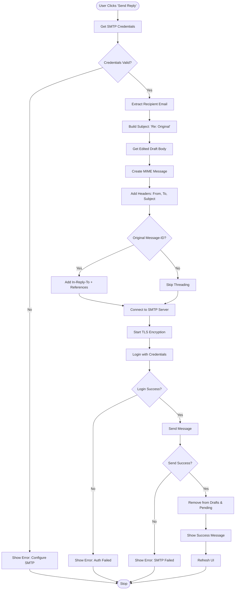
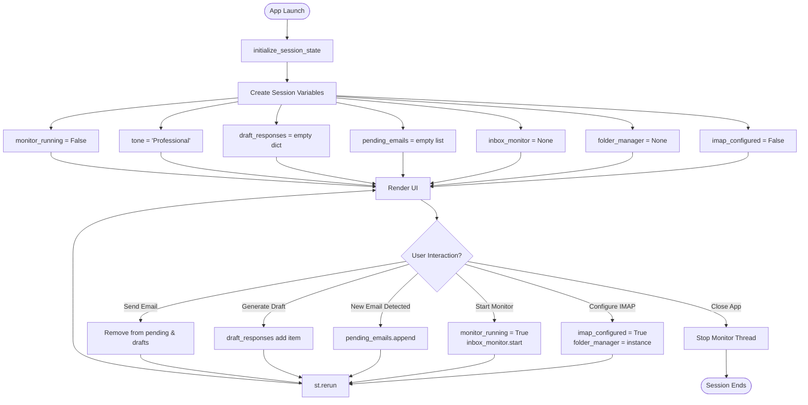
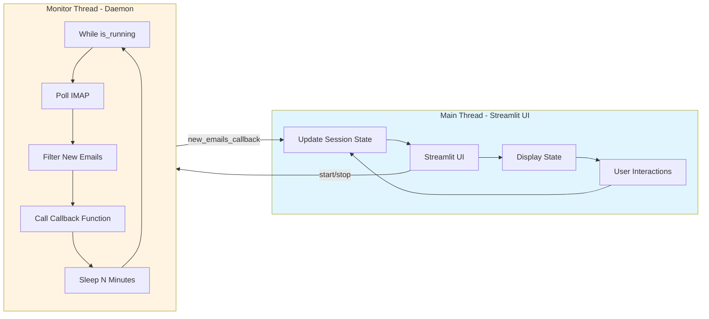
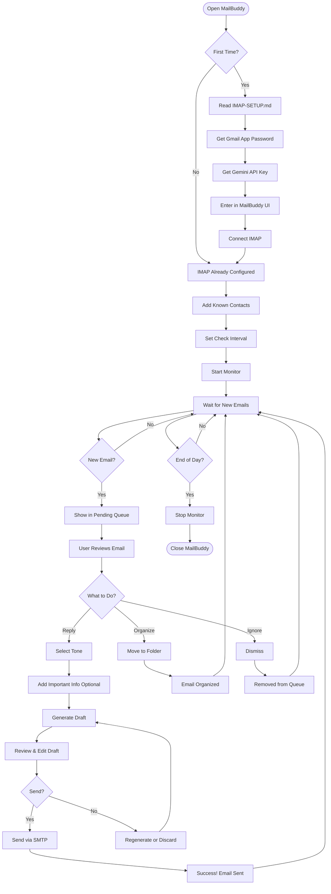
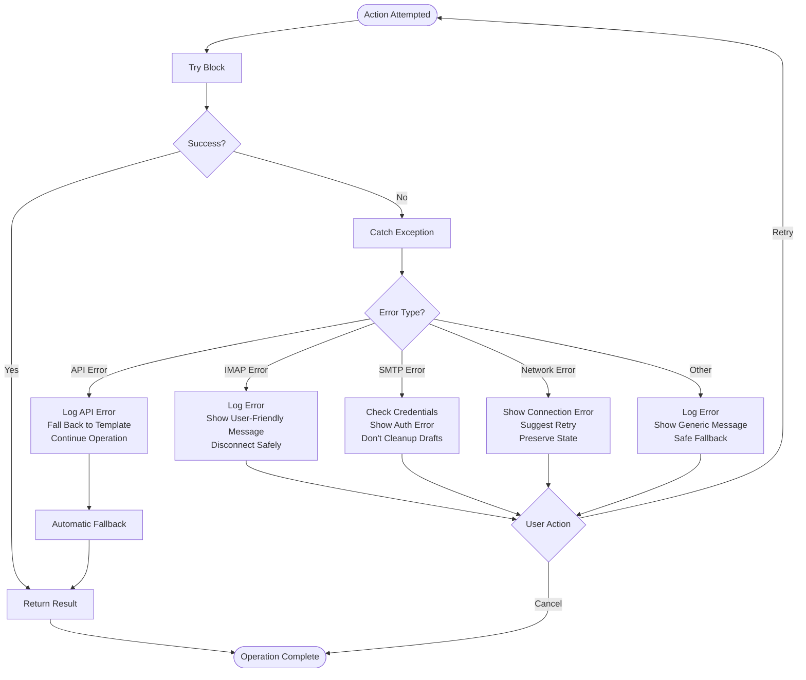
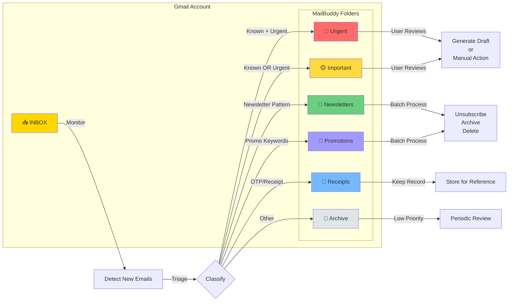

# MailBuddy Process Flowcharts

Visual guides for understanding MailBuddy's workflows and processes.

---

## 1. IMAP Configuration Flow

---

## 2. Inbox Monitoring Loop

---

## 3. Email Triage Classification Process

---

## 4. Draft Generation Workflow

---

## 5. Send Reply Flow

---

## 6. Session State Lifecycle

---

## 7. Background Thread Architecture

---

## 8. Complete User Journey

---

## 9. Error Handling Flow

---

## 10. Folder Organization System

---

## Legend

### Flowchart Symbols

- **Rectangle**: Process/Action
- **Diamond**: Decision/Condition
- **Parallelogram**: Input/Output
- **Rounded Rectangle**: Start/End
- **Arrow**: Flow Direction
- **Dashed Line**: Optional Path

### Color Coding

- 🔴 **Red**: Urgent/High Priority
- 🟡 **Yellow**: Important/Medium Priority
- 🟢 **Green**: Success/OK
- ⚫ **Gray**: Stopped/Inactive
- 🔵 **Blue**: Information/Process

---

## How to Use These Flowcharts

1. **For Learning**: Follow the flows to understand MailBuddy's logic
2. **For Debugging**: Trace where an issue occurs in the flow
3. **For Development**: Use as reference when modifying code
4. **For Documentation**: Share with team members or users

---

## Interactive Mermaid Diagrams

These diagrams are written in **Mermaid** syntax and can be:

- Rendered in GitHub README
- Viewed in Mermaid Live Editor: https://mermaid.live/
- Embedded in documentation sites
- Exported as SVG/PNG images

### Viewing Tips

**In VS Code**:
1. Install "Markdown Preview Mermaid Support" extension
2. Open this file in preview mode
3. Diagrams render automatically

**In GitHub**:
1. Push this file to your repository
2. Navigate to it in GitHub UI
3. Mermaid diagrams render natively

**In Browser**:
1. Copy a diagram
2. Paste into https://mermaid.live/
3. Edit and export as needed

---

**For more information, see:**
- [IMAP Setup Guide](IMAP-SETUP.md)
- [Automation Guide](automation-guide.md)
- [Main README](../README.md)
